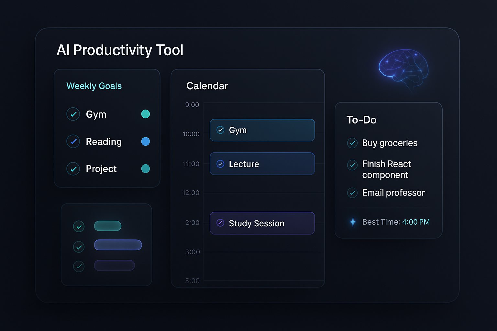

  

# 🗓️ AI Productivity Tool – Smart Calendar & Task Manager  

A modern productivity platform designed to help busy individuals automate and optimise their daily and weekly schedules.  

This SaaS tool provides an **AI-driven interactive calendar** with integrated task management, enabling users to spend less time planning and more time doing.  

---

## 🚀 Overview  

The AI Productivity Tool combines:  

- 📅 **Calendar Views** – daily and weekly scheduling at a glance  
- ✅ **To-Do Lists** – simple, persistent task tracking  
- 🎯 **Goal Tracking** – recurring weekly goals (e.g. gym, study, personal projects)  
- 🤖 **AI Time Suggestions** – intelligent recommendations for when to complete unplanned tasks  

Tasks and goals can be added instantly from a mobile interface. The scheduling engine automatically:  

- Suggests the best available time slots  
- Avoids conflicts with existing events  
- Prioritises around fixed commitments and recurring goals  

---

## ✨ Key Features (MVP & Planned)  

- 💻 **Cross-platform desktop app** built with Electron + React + TailwindCSS  
- 🔄 **Real-time sync** 
- 📱 **Mobile input app** (React Native/PWA – in development)  
- 🎯 **Smart weekly goal scheduling** – e.g. “Workout 3×/week”, “Read 2h”  
- 🧠 **AI scheduling** – automatically suggest to-Dos into your calandar
- 🔔 **Reminders & notifications** (future enhancement)  
- 📊 **Analytics dashboard** to review productivity trends (future enhancement)  

---

## 🗂️ Project Structure  

